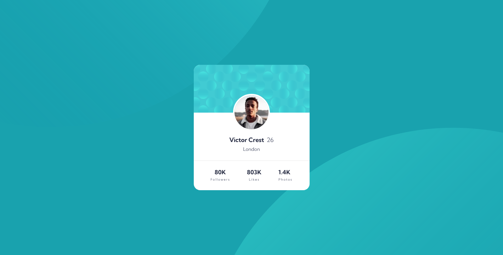
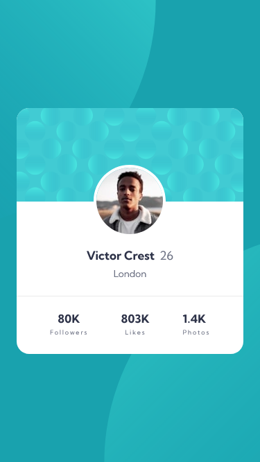

# Frontend Mentor - Profile card component solution

This is a solution to the [Profile card component challenge on Frontend Mentor](https://www.frontendmentor.io/challenges/profile-card-component-cfArpWshJ). Frontend Mentor challenges help you improve your coding skills by building realistic projects.

## Table of contents

- [Overview](#overview)
  - [The challenge](#the-challenge)
  - [Screenshot](#screenshot)
  - [Links](#links)
- [My process](#my-process)
  - [Built with](#built-with)
  - [What I learned](#what-i-learned)
  - [Continued development](#continued-development)
  - [Useful resources](#useful-resources)
- [Author](#author)
- [Acknowledgments](#acknowledgments)

## Overview

### The challenge

- Build out the project to the designs provided

### Screenshot




### Links

- Solution URL: [Project on Github](https://github.com/joanFaseDev/profile-card)
- Live Site URL: [Project hosted through Vercel](https://profile-card-ochre-seven.vercel.app/)

## About myself

Hi everyone! I'm an aspiring front-end developper so this project is probably not the best learning material out there yet i'll try to explain my process, what i did and for what reasons, to the best of my abilities. Which brings me to my second point: english isn't my first language so please forgive me for any mispellings or grammatical errors, past or future. Now that's out of the way, let's dig in!

## My process

### Analysis

- Interesting background made out of two partially overflowed SVGs and, on a layer below, what appears to be a gradient.

- Only difference between mobile and desktop design seems to be larger margins between the Followers, Likes and Photos entries at the bottom of the card.

- Card can be divided in three parts: Photo, infos and social medias.

### Planning

#### HTML

- Create a _main_ element to act as the profile card.
- Create two _sections_, one for the user's info, the other for his social medias.
- In the first _section_, create two _divs_. The first for the photo and the background's card. The second for the name, age and city. Use _h2_ and _h3_ for the various entries, mainly because these elements are already weighted. Plus their font size seems to match the template.
- In the second _section_, create three _divs_. One for each metrics (followers, likes and photos). By doing so, aligning theses entries later will be really easy. Plus each _div_ can be transformed in a flexbox to align vertically its number and its name.

#### CSS

- Use Flexbox to align the three parts as well as the items nested inside.

### Built with

- Semantic HTML5 markup
- CSS custom properties
- Flexbox
- CSS Grid
- Mobile-first workflow
- [React](https://reactjs.org/) - JS library
- [Next.js](https://nextjs.org/) - React framework
- [Styled Components](https://styled-components.com/) - For styles

**Note: These are just examples. Delete this note and replace the list above with your own choices**

### What I learned

Use this section to recap over some of your major learnings while working through this project. Writing these out and providing code samples of areas you want to highlight is a great way to reinforce your own knowledge.

To see how you can add code snippets, see below:

```html
<h1>Some HTML code I'm proud of</h1>
```

```css
.proud-of-this-css {
  color: papayawhip;
}
```

```js
const proudOfThisFunc = () => {
  console.log("🎉");
};
```

If you want more help with writing markdown, we'd recommend checking out [The Markdown Guide](https://www.markdownguide.org/) to learn more.

**Note: Delete this note and the content within this section and replace with your own learnings.**

### Continued development

Use this section to outline areas that you want to continue focusing on in future projects. These could be concepts you're still not completely comfortable with or techniques you found useful that you want to refine and perfect.

**Note: Delete this note and the content within this section and replace with your own plans for continued development.**

### Useful resources

- [MDN Article || At-rules](https://developer.mozilla.org/en-US/docs/Web/CSS/At-rule) - Explain how At-rules CSS statements change the way the language works and how to use them.
- [Example resource 2](https://www.example.com) - This is an amazing article which helped me finally understand XYZ. I'd recommend it to anyone still learning this concept.

**Note: Delete this note and replace the list above with resources that helped you during the challenge. These could come in handy for anyone viewing your solution or for yourself when you look back on this project in the future.**

## Author

- Frontend Mentor - [@joanFaseDev](https://www.frontendmentor.io/profile/joanFaseDev)
